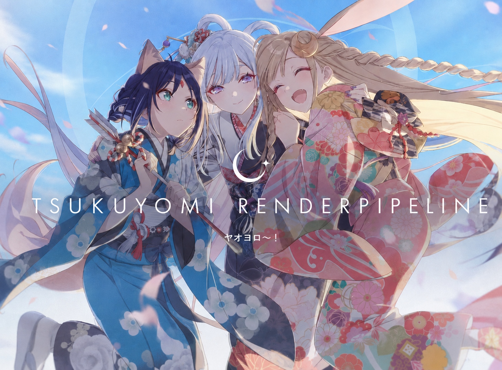

# TsukuyomiRP

TsukuyomiRP is an experimental collection of custom rendering features for Unity's Universal Render Pipeline (URP).

> [!WARNING]
> This package is under active development. APIs and rendering behavior may change between releases.

## Requirements

- Unity 6000.5 or newer
- Universal Render Pipeline 17.5.0

## Installation

In Unity, open **Window > Package Management > Package Manager**, select **Install package from git URL**, and enter:

```text
https://github.com/kx1125/TsukuyomiRP.git#v0.1.4
```

You can also add the package directly to your project's `Packages/manifest.json`:

```json
{
  "dependencies": {
    "tsukuyomi.render-pipelines.universal": "https://github.com/kx1125/TsukuyomiRP.git#v0.1.4"
  }
}
```

## Samples

The **LookDev** sample contains a subway scene configured to demonstrate TsukuyomiRP rendering features.

1. Open **Window > Package Management > Package Manager** and select **TsukuyomiRP**.
2. Open the **Samples** tab and import **LookDev**.
3. In the setup prompt, select **Apply and Open**.

The setup assigns the imported `SampleScene_Asset.asset` to Graphics Settings and the active Quality level, repairs APV Scene GUID references if the sample importer changed them, and opens `LookDev.unity`. If the prompt was dismissed, run **Tools > Tsukuyomi RP > Samples > Setup LookDev Sample**.

The sample render pipeline asset references its included renderer and Tsukuyomi pipeline profile. Applying it changes rendering for the current project, so restore your previous pipeline asset after evaluating the sample if necessary.

## License

This project is licensed under the [MIT License](LICENSE).
